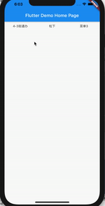

# drop_down_menu
一个简单的drop_down_menu，支持任意widget。

将JDDropdownMenuWidget放到任意位置即可。


```dart
JDDropdownMenuWidget(
              controller: controller,
              itemStyle: JDDropdownMenuWidgetStyle.style2,
              click: (int index) {
                print('$index');
              },
              items: [
                JDDropdownMenuItem(
                  maxHeight: 300,
                  title: Container(
                    alignment: Alignment.topCenter,
                    margin: EdgeInsets.only(
                      left: 10,
                      right: 10,
                    ),
                    child: Text(title1),
                  ),
                  menu: CityWidget(
                    click: (String selectedValue) {
                      setState(() {
                        title1 = selectedValue;
                        controller.hide();
                      });
                      print('选择的城市为:$selectedValue');
                    },
                  ),
                ),
                JDDropdownMenuItem(
                  maxHeight: 300,
                  title: Container(
                    alignment: Alignment.topCenter,
                    margin: EdgeInsets.only(
                      left: 10,
                      right: 10,
                    ),
                    child: Text(title2),
                  ),
                  menu: MenuListWidget(
                    selectedValue: title2,
                    click: (String value) {
                      setState(() {
                        title2 = value;
                        controller.hide();
                      });
                    },
                  ),
                ),
                JDDropdownMenuItem(
                  title: Container(
                    alignment: Alignment.topCenter,
                    margin: EdgeInsets.only(
                      left: 10,
                      right: 10,
                    ),
                    child: Text('菜单3'),
                  ),
                  menu: Container(
                    color: Colors.blue,
                  ),
                ),
              ],
   )
```


